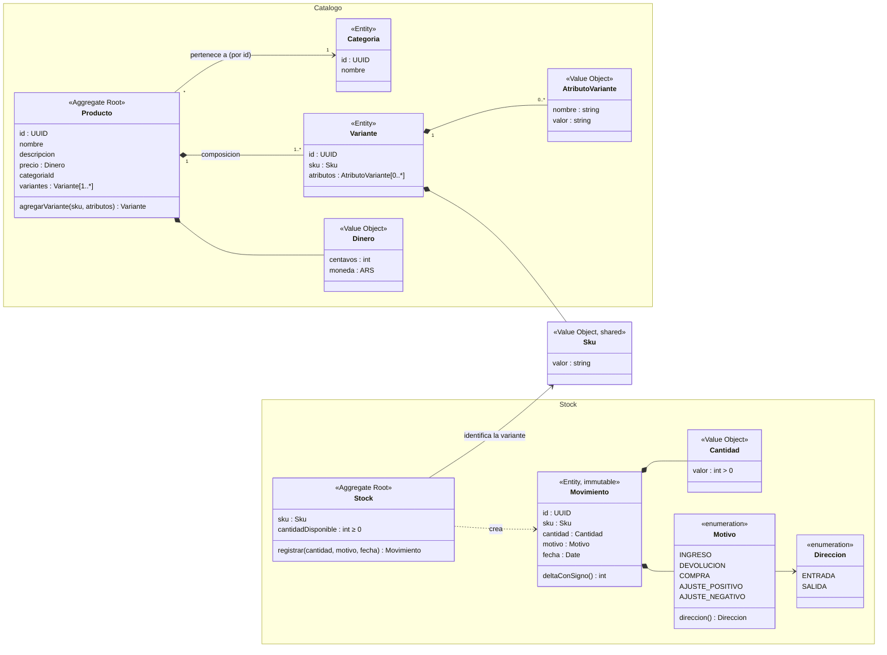

# Bidcom challenge: POST /stock/movimientos

Implement stock movements with two bounded contexts (Catalogo, Stock) joined only by Sku, a hexagonal Stock module whose `Stock` aggregate defines the never-negative rule while the adapter enforces it atomically on SQLite and PostgreSQL, built-in node:test checks, a seed script and Spanish docs, delivered as a readable commit series. The domain model, API and persistence use the statement's own Spanish terms (ubiquitous language).

## Decisions (confirmed with user)
- **Architecture:** hexagonal (domain / application / ports / adapters) for `stock`. Two bounded contexts, **Catalogo** and **Stock**, share only the `Sku` value object.
- **Variants:** composition, not inheritance. `Variante` is an entity inside the `Producto` aggregate; talle/color are data (a list of `AtributoVariante { nombre, valor }`), not subclasses.
- **Variant attributes storage:** a related `atributo_variante` table (many-to-one with `variante`), not a JSON column.
- **Invariants live in the domain.** Entities and value objects are created valid and enforce every invariant they can see, without relying on infrastructure. Database constraints model the same rules for data integrity only (backstop). Where a rule spans concurrent requests or aggregates, the database arbitrates the race and the adapter translates the violation into the **same** domain error. See "Invariants: domain vs database".
- **Identity generated by the app.** Entity ids are UUIDs created in the domain factories with `crypto.randomUUID()` (Node standard library, no dependency), so an entity has its identity from construction and does not depend on the database.
- **Money (`Dinero`):** integer minor units (`precio_centavos`), no decimal library. YAGNI: the challenge does no price arithmetic, and a DECIMAL column would not be exact on SQLite (stored as REAL).
- **Catalogo scope:** option (a), final. Catalogo is persistence only; its domain is documented as the target model. See "Decision record: Catalogo scope".
- **Databases:** keep both (decision deferred to the last responsible moment). The two config switches are reconciled into one source of truth. SQLite is the default. The same tests can run on Postgres.
- **ORM:** keep TypeORM; Prisma was evaluated and rejected for now. A Prisma schema supports a single provider (`env()` is not allowed in `provider`, multiple datasources are not allowed), so testing on both databases would need two schemas, two migration folders and two generated clients. TypeORM already supports both in the starter. Decorators stay confined to the `*.orm-entity.ts` adapter files; the domain is plain TypeScript. The ORM sits behind the `StockRepository` port, so switching later only touches the persistence adapters. Revisit when a single database is chosen; if so, pin `prisma@7.10.0` (npm `latest` pointed to `8.0.0-rc.17`, a 4-day-old release candidate, on 2026-09-28).
- **Request validation:** Zod (`zod@4.6.5`, exact pin; no dependencies, no install scripts) replaces `class-validator` and `class-transformer`, which are removed (their only use was the global `ValidationPipe`; no coercion or response serialization is needed). A ~10-line `ZodValidationPipe` (the pattern from Nest's docs, no `nestjs-zod`) is bound per route; the DTO type is `z.infer` of the schema, so type and validation can't drift. No validation decorators. The same library also declares and validates the environment (next bullet) — one validation tool for both boundaries.
- **Environment: declared, validated, shared via ConfigService.** `src/env.ts` holds a Zod schema listing **every** variable the app reads; `z.infer` gives the `Env` type (machine-checked "which variables exist"). `ConfigModule.forRoot({ isGlobal: true, validate: loadEnv })` keeps the scaffold's approach — ConfigModule loads `.env` + `process.env`, runs the schema once at bootstrap (fail fast, readable error per bad var — 12-factor config), and `ConfigService<Env, true>` hands **typed** values to any consumer via DI, read as `get('app.port', { infer: true })` / `get('database', { infer: true })`. **No defaults in the schema**: every required variable must be set explicitly — a missing one is a startup error, never a silent fallback (a silent `DB_TYPE=sqlite` default is exactly the surprise that costs a day). The schema is a `z.discriminatedUnion('DB_TYPE', …)`: sqlite vars required XOR postgres vars required. A `.transform()` then reshapes the flat `SCREAMING_SNAKE_CASE` input into nested camelCase concerns — `{ app: { port, nodeEnv }, database: { type: 'sqlite', database } | { type: 'postgres', host, port, username, password, database } }` — so `Env['database']` is a union that narrows on `type` (postgres fields are plain `string`/`number`, never optionals) and consumers never see env-var naming. Ports are validated to `1–65535`; `NODE_ENV` and `COMMIT_HASH` (CI-injected, feeds the wide event) are the only optional vars. `dataSourceOptions(db: DbConfig)` still takes its input explicitly (`DbConfig` = `Env['database']`; no `process.env` reads), so the same function serves `TypeOrmModule.forRootAsync` (`config.get('database', { infer: true })`), the seed and the migration CLI's `AppDataSource`. `AppDataSource` is **not** the app's database bootstrap: it exists only as the `-d src/data-source.ts` entry point for the TypeORM migration CLI; the app's DataSource comes from `TypeOrmModule.forRootAsync`.
- **Zod checks shape, the domain checks rules.** Zod: types, required fields, no extra fields (`z.strictObject`), `motivo` in the enum. Value objects: `Sku` trimmed and non-empty; `Cantidad` a positive safe integer. Each rule lives in one place. All error responses share one body: RFC 9457 problem details (next bullet).
- **Error responses: RFC 9457.** Every error response is `application/problem+json` with `{type, title, status, detail, instance}` (https://www.rfc-editor.org/rfc/rfc9457.html). `type` is `urn:problem:<slug>` per failure kind (`stock-insuficiente`, `variante-no-encontrada`, `cantidad-invalida`, `sku-invalido`, `validacion`; `about:blank` for unexpected 500s), `instance` carries the request's `requestId` so a response correlates with its wide event, and extension members carry specifics (`errors` for the 400 cases, `stockDisponible` for 409). The `DomainErrorFilter` catches everything, not just domain errors, so a framework-thrown error is still a problem detail.
- **No invented limits.** No business maximum for `cantidad` and no maximum length for the SKU in the domain (neither is a requirement). Technical limits only: `Cantidad` must be a safe integer (`Number.isSafeInteger`, the largest integer JS represents exactly; without it a value like `1e20` would be stored as a float on SQLite); Postgres `integer` overflow (error `22003`) is translated by the adapter into `CantidadInvalidaError` (400). No length limit on SKUs either: SKU columns are `text` (Postgres `varchar(n)` is just a check — same storage and performance as `text`; SQLite ignores the length anyway). The only residual cap is Postgres's B-tree index-entry size (~2.7KB), reachable only on insert — which stock endpoints never do — so any unknown SKU gets 404, never a database error.
- **API docs (contract-first):** `docs/openapi.yaml` is written **before** any implementation and is the API's source of truth (2 endpoints, request/response/error schemas, status codes); the e2e cycles are its executable check. Served at `GET /docs` with `swagger-ui-express` (exact pin; the yaml is served raw via `swaggerOptions.url`, so no yaml parser). `@nestjs/swagger` rejected: it generates the spec from decorators on DTO *classes* — code-first, the opposite direction — and our DTOs are `z.infer` types with no classes to decorate. Drift risk between the contract and the Zod schema is real but small (4 schemas, reviewed by hand).
- **Observability — wide events:** one structured event per request, emitted exactly once at the end — success or failure — as a single JSON line to stdout (canonical log lines: https://loggingsucks.com/; the `logging-best-practices` skill is installed globally and governs this). Fields: request metadata (`requestId`, `method`, `path`, `statusCode`, `durationMs`), domain context the request itself enriches (`sku`, `cantidad`, `motivo`, outcome, `error{type,message}` on failures), and environment context captured once at startup (`service`, `version`, `commitHash`, `instanceId`, `nodeEnv`) — assembled in one place (`eventContext()` inside the middleware file), from deliberately mixed sources: identity from `package.json` (source of truth; `npm_package_*` vars only exist under `npm run`, so they are launcher-dependent and were rejected), `commitHash`/`nodeEnv` from the validated env (`COMMIT_HASH` is optional, CI-injected — unset locally, the key is just omitted), `instanceId` from `os.hostname()`. Two levels only: `info` normally, `error` when `outcome` is `error`. Implemented as a `wideEventMiddleware` (express middleware, not an interceptor: `als.run` must wrap the whole pipeline, and `res.on('finish')` sees the real statusCode) + an `AsyncLocalStorage` context (`node:async_hooks`, stdlib); no scattered log lines and no logging library — one write per request doesn't need one. `ponytail: no tail sampling (keep errors + slow requests, sample the rest) — meaningless at dev volumes; emission is one place, so a shouldSample(event) predicate slots in later without touching the format.`
- **Tests:** built-in `node:test` + the already-installed `ts-node` + native `fetch`. No new dependencies. Specs are test-first and follow Arrange / Act / Assert (see "Implementation steps").
- **Language (ubiquitous language):** the API, docs, domain model and table/column names use the statement's Spanish terms — `Producto`, `Variante`, `Categoria`, `AtributoVariante`, `Dinero`, `Stock`, `Movimiento`, `Cantidad`, `Motivo`, `Direccion`, `Sku`, `cantidadDisponible`, `fecha`. This holds in `domain/` and `application/` (`StockService.registrarMovimiento`, port methods `buscar`/`crear`/`guardar`); technical suffixes and infrastructure keep English names (`*Service`, `*Repository`, `*OrmEntity`, pipes, filters, controller). Commits in English, following [Conventional Commits](https://www.conventionalcommits.org) — `type(scope): subject` (`feat`, `fix`, `test`, `chore`, `docs`, `refactor`; scope optional, e.g. `feat(stock):`, `chore(deps):`). DDD vocabulary itself is not translated — it names patterns, not domain concepts: value object, aggregate root, entity, port, adapter and bounded context stay in English (same as the `*Service`/`*Repository` suffixes).
- **Doc comments: TSDoc, English prose.** Exported declarations (classes, functions, ports, public methods) carry `/** … */` doc comments in [TSDoc](https://tsdoc.org) format — `@param`, `@returns`, `@throws`, `@remarks`. Prose is **English**: only domain words appear in Spanish, spelled exactly as in code (`Sku`, `cantidadDisponible`, `Stock.registrar`). The only words in Spanish anywhere are the ubiquitous-language ones. Exceptions: error `detail` messages stay Spanish (API output, already in the contract's examples) and spec titles stay Spanish (deliberate executable narration of domain behaviour). Inline `//` comments follow the same rule, and `ponytail:` markers keep their format. No eslint-plugin-tsdoc dependency: a convention reviewers can check, not another package.
- **Tooling:** everything runs through `docker compose run --rm app npm …` (no shell alias).

## Domain model


### Catalogo context ("what do we sell")
> Target model. Only its persistence is built for this challenge; see "Decision record: Catalogo scope".

- `Producto` is the aggregate root; its `Variante`s live inside it (composition, `1..*`). A product without visible options has **one default `Variante`**, so stock and cart always work on variants.
- `Categoria` is referenced **by id** (independent lifecycle).
- `Dinero`: `centavos` + `moneda` (`ARS`), never a float.
- `AtributoVariante`: value object `{ nombre, valor }`, e.g. `talle=42`, `color=negro`. A `Variante` holds a list of them (`0..*`: a default variant has none — attributes exist to distinguish sibling variantes, and a single-SKU `Producto` such as a service or a book has nothing to distinguish, so zero attributes is the honest case, not a defect; forcing ≥1 would only produce synthetic attributes like Shopify's "Default Title"). Works for any product type with no schema change.
- `Variante` invariants (enforced by its constructor): attribute `nombre`s are trimmed, lowercase, non-empty and **unique within the variant**; `valor`s are non-empty.
- `Producto` invariants: at least one `Variante`; no two variants with the same attribute combination (compared sorted by `nombre`); SKU unique across variants (cross-aggregate: checked via a port, guaranteed by the DB under races).
- Ids: `Categoria`, `Producto` and `Variante` get `randomUUID()` in their factories.
- Upgrade path (documented): option / option-value tables (`AtributoVariante` gains an `opcionValorId`) when names must be normalised per product or validated per category.

### Stock context ("how many can we sell, and what happened")
- `Stock` is the aggregate root guarding the invariant **`cantidadDisponible ≥ 0`**. It has one behaviour, `registrar(cantidad, motivo, fecha)`:
  - delta = `cantidad × motivo.direccion()`;
  - if `cantidadDisponible + delta < 0` → `StockInsuficienteError`;
  - else updates `cantidadDisponible` and **returns** a new immutable `Movimiento`, created valid with its id (`randomUUID()`) and `fecha` (the `fecha` passed in).
- `Stock` creates movements but does **not** hold the history (loading every movement to change one number would scale badly).
- `Cantidad`: positive safe integer (`Number.isSafeInteger`, no business maximum). `0`, negatives, fractions and unsafe integers can't be represented in the domain (`CantidadInvalidaError`).
- `Sku`: trimmed, non-empty (`SkuInvalidoError`); no maximum length in the domain. Shared by both contexts; it is the only link between them.

### Reasons (answer to "¿qué motivos aceptás?")
| motivo | direccion | meaning |
|---|---|---|
| `INGRESO` | ENTRADA | supplier restock |
| `DEVOLUCION` | ENTRADA | customer return |
| `COMPRA` | SALIDA | customer purchase (the statement's wording) |
| `AJUSTE_POSITIVO` | ENTRADA | manual adjustment up |
| `AJUSTE_NEGATIVO` | SALIDA | manual adjustment down |

### Insufficient stock (answer to "qué pasa cuando no hay stock suficiente")
The movement is rejected with **409**, nothing is recorded, and the body is a problem detail (`urn:problem:stock-insuficiente`) with `stockDisponible` as an extension member. No exception for `AJUSTE_NEGATIVO`: stock never goes negative.

### Domain errors → HTTP (mapped only in the HTTP adapter)
The filter keeps a `ErrorClass → status` map; `type` is derived (`urn:problem:` + the kebab-cased class name minus `Error`) and `title`/`detail` come from the error's own `summary`/`message` (domain-neutral attributes — RFC 9457 vocabulary stays in the adapter), so a new domain error needs one map line plus its `summary` field. The only extension-member special case is `StockInsuficienteError.cantidadDisponible` → `stockDisponible`.

| error | `type` (`urn:problem:*`) | raised by | HTTP |
|---|---|---|---|
| `CantidadInvalidaError` / `SkuInvalidoError` / `MotivoInvalidoError` | `cantidad-invalida` / `sku-invalido` / `motivo-invalido` (derived) | value objects and `Motivo.desde` (already caught earlier by the Zod enum; the error guards the domain boundary); `CantidadInvalidaError` also by the adapter (Postgres `22003` integer out of range) | 400 |
| *(Zod shape error)* | `validacion` | `ZodValidationPipe` | 400 |
| `VarianteNoEncontradaError` | `variante-no-encontrada` | application service (no `Stock` for the SKU) | 404 |
| `StockInsuficienteError` | `stock-insuficiente` | `Stock.registrar()` or the adapter (lost race) | 409 |
| *(any other throw)* | `about:blank` | framework/unknown | 500 |

## Invariants: domain vs database
**Principle:** the domain enforces every invariant it can see; database constraints repeat those rules only as an integrity backstop. A rule that spans concurrent requests or aggregates needs a single point that serializes them, and in-process code can't be that point across requests; the database is. When that backstop fires, the adapter translates it into the domain's own error, so use cases and clients never see an infrastructure error.

| Invariant | Scope | Domain (primary) | Database (backstop) |
|---|---|---|---|
| `Cantidad` positive safe integer; `Sku` trimmed and non-empty | one value | value object constructors | `CHECK delta <> 0`; Postgres `integer` range (`22003` → `CantidadInvalidaError`) |
| `cantidadDisponible ≥ 0` for one request | one aggregate | `Stock.registrar()` | `CHECK cantidad_disponible >= 0` |
| `cantidadDisponible ≥ 0` under concurrent requests | across requests | rejects on its snapshot, can't see a concurrent commit | conditional `UPDATE`; adapter maps "0 rows" to `StockInsuficienteError` |
| Attribute names unique within a variant *(target model)* | one aggregate | `Variante` constructor | `PK (variante_id, nombre)` |
| SKU unique across variants *(target model)* | across aggregates | checked via a port, `SkuDuplicadoError` | unique index; adapter maps the violation to `SkuDuplicadoError` |

Within one request, the app never depends on a constraint for correctness; it depends on the database only to arbitrate races.

## Application flow: `POST /stock/movimientos`
1. `ZodValidationPipe` checks the body's shape; the controller builds `Sku`, `Cantidad`, `Motivo` (value objects enforce the rules).
2. `StockService.registrarMovimiento()` loads the `Stock` via the `StockRepository` port → none: `VarianteNoEncontradaError`.
3. `stock.registrar(cantidad, motivo, ahora)` → fast fail on the loaded snapshot, or returns the `Movimiento`.
4. `repository.guardar(movimiento)` → the adapter, in one transaction:
   - `UPDATE stock SET cantidad_disponible = cantidad_disponible + :delta WHERE sku = :sku AND cantidad_disponible + :delta >= 0` (writes the **delta**, never the in-memory absolute value);
   - 0 rows affected → another request won the race → `StockInsuficienteError`;
   - 1 row → insert the movement row, re-read `cantidad_disponible`;
   - Postgres error `22003` (integer out of range) → `CantidadInvalidaError`.
5. Response 201 with the movement and the new `stockDisponible`.

The domain **defines** the rule and is unit-testable without a database. The adapter **enforces** it atomically, because a read-modify-write of the aggregate would race.

## Concurrency
- **Postgres:** the conditional UPDATE takes a row lock; a waiting transaction re-checks the `WHERE` after getting it, so no overselling and no `SELECT … FOR UPDATE`.
- **SQLite:** TypeORM shares one QueryRunner, so concurrent `transaction()` calls nest as SAVEPOINTs. The adapter serializes its transactions with a small in-process promise mutex when `type === 'sqlite'`. Marked `ponytail: single-process only; SQLite is single-writer anyway, Postgres path uses real transactions`.
- DB `CHECK (cantidad_disponible >= 0)` as the last backstop.

### Evidence for the SQLite claim
- `node_modules/typeorm/driver/sqlite/SqliteDriver.js` lines 42-46: `createQueryRunner()` always returns the same `this.queryRunner`.
- `node_modules/typeorm/driver/sqlite-abstract/AbstractSqliteQueryRunner.js` lines 69-83: with a transaction already open (`transactionDepth > 0`), `startTransaction()` issues `SAVEPOINT` instead of `BEGIN`, so two concurrent requests nest inside each other's transaction.
- `node_modules/typeorm/driver/sqlite/SqliteQueryRunner.js` line 102: `result.affected = this.changes`, so the affected-row count is available on SQLite.
- Upstream discussion: https://github.com/typeorm/typeorm/issues/1884

## Persistence mapping (adapters only; the domain never sees it)
| table | columns | owner |
|---|---|---|
| `categoria` | id uuid PK, nombre unique | catalogo |
| `producto` | id uuid PK, nombre, descripcion, precio_centavos int, moneda, categoria_id FK | catalogo |
| `variante` | id uuid PK, sku text unique, producto_id FK | catalogo |
| `atributo_variante` | **PK (variante_id, nombre)**, variante_id FK → variante ON DELETE CASCADE, nombre text, valor text | catalogo |
| `stock` | sku text PK, cantidad_disponible int default 0, CHECK cantidad_disponible >= 0 (no FK to variante: declaring it needs an ORM relation, which would import a Catalogo entity — contexts meet only at `Sku`; `crearItem` is the enforcement) | stock |
| `movimiento_stock` | id uuid PK, sku FK → stock, delta int CHECK delta <> 0, motivo simple-enum, fecha | stock |

- **Ids:** assigned by the domain (`randomUUID()`), never generated by the database. TypeORM `@PrimaryColumn('uuid')` maps to native `uuid` on Postgres and `varchar` on SQLite (`AbstractSqliteDriver.js` line 446), so it stays portable. `ponytail: UUID v4 is random, so B-tree inserts have poor locality at large volumes; switch to UUIDv7 if insert-heavy tables grow large (Node 22 has no built-in v7).`
- **No length limits on text columns.** `sku`, `nombre`, `valor` are `text`: Postgres `varchar(n)` adds a check but no storage or performance gain, and SQLite ignores the length anyway — a `varchar(n)` would be an invented limit. The only residual cap is Postgres's B-tree index-entry size (~2.7KB), reachable only on insert; the stock endpoints never insert SKUs, so an over-length SKU gets 404, never a database error.
- **`atributo_variante` has no surrogate id:** `AtributoVariante` is a value object (no identity), so its row is identified by `(variante_id, nombre)`. That composite PK is also the uniqueness backstop.
- **Why a related table instead of a JSON column:** TypeORM's `simple-json` is plain `TEXT` on both databases, so it can't be indexed, filtered or constrained; `jsonb` would be Postgres-only and break dual-database support. The table is plainly relational, filterable in SQL (`nombre = 'talle' AND valor = '42'`) on both databases, and halfway to option tables (replace `nombre`/`valor` text with foreign keys). Cost: one ORM entity file and one join when loading variants (Stock never loads attributes).
- **Invariant checkable in SQL:** `stock.cantidad_disponible == SUM(movimiento_stock.delta)` per SKU. Stock only changes through movements (the seed too).
- `delta` is stored signed so the invariant is a plain `SUM`; the mapper rebuilds `Cantidad = |delta|`.
- **Why a separate `stock` table, not a column on `variante`:** each context owns its tables, so the stock adapter never touches catalog entities. The cost is one extra table. Creating a variant must create its `Stock(cantidadDisponible 0)`. Today only the seed creates variants; with catalog CRUD, variant creation would do it (or publish an event).

## API
- `POST /stock/movimientos`, body `{ sku, cantidad, motivo }`
  - 201 `{ id, sku, cantidad, motivo, fecha, stockDisponible }`
  - 400 validation: shape by Zod (`z.strictObject` rejects extra fields; `"3"` as a string is rejected), rules by the value objects; all errors `application/problem+json` (RFC 9457, `errors` extension member for Zod details)
  - 404 unknown SKU (including over-length SKUs), 409 insufficient stock (problem detail with `stockDisponible` member)
- `GET /stock/:sku` → `{ sku, stockDisponible }`. Covers "the system must always be able to answer how much stock is available" and the cart pre-check.

## Target layout
```
docs/
  openapi.yaml                    API contract — written first, served at /docs
src/
  data-source.ts                  dataSourceOptions(env) — single source of truth
  app.module.ts                   forRoot({...dataSourceOptions(), synchronize: true})
  main.ts                         (global ValidationPipe removed; serves /openapi.yaml + Swagger UI at /docs)
  seed.ts
  app.e2e.spec.ts
  shared/domain/sku.ts            Sku
  shared/domain/sku-invalido.error.ts
  shared/infrastructure/http/zod-validation.pipe.ts
  shared/infrastructure/http/wide-event.middleware.ts    one JSON event per request
  shared/infrastructure/http/request-context.ts          AsyncLocalStorage store; enrichWideEvent()
  shared/infrastructure/http/domain-error.filter.ts      catches all errors → RFC 9457 problem+json (400/404/409/500); registered in app.module.ts — app-wide boundary, not a stock concern
  catalogo/
    catalogo.module.ts
    infrastructure/persistence/{categoria,producto,variante,atributo-variante}.orm-entity.ts
                                  no domain/ application/ http/ yet: see "Decision record: Catalogo scope"
  stock/
    stock.module.ts               binds StockRepository → TypeOrmStockRepository
    domain/
      motivo.ts                   Motivo, Direccion, direccion()
      cantidad.ts
      stock.ts                    aggregate root: crear(sku), registrar()
      movimiento.ts
      errors.ts                   barrel — one error class per file
      *.error.ts                  CantidadInvalidaError, MotivoInvalidoError,
                                  StockInsuficienteError, VarianteNoEncontradaError
      stock.repository.ts         port (abstract class = Nest DI token, no Symbol): buscar, crear, guardar
      stock.spec.ts               domain unit check, no DB
    application/stock.service.ts  crearItem(), registrarMovimiento(), stockDisponible()
    infrastructure/
      persistence/stock.orm-entity.ts
      persistence/movimiento-stock.orm-entity.ts
      persistence/typeorm-stock.repository.ts   conditional UPDATE + SQLite mutex + 22003 translation + mappers
      http/stock.controller.ts
      http/register-movement.schema.ts          Zod schema + z.infer type
```

## Decision record: Catalogo scope
**Status:** accepted, final (option a, lean). Options considered: (a) persistence only; (a+) only `Variante` + `AtributoVariante` domain classes; (b) full Catalogo domain with port and adapter.

**Context.** The challenge asks for one endpoint, `POST /stock/movimientos`. No endpoint creates, reads or changes catalog data; only the seed and the tests create products. Option (b) would add about 7 files that only the seed exercises. The Catalogo bounded context is not necessary to solve the statement; it may be added later if time allows.

**Decision.** Build Catalogo as **persistence only**: `categoria`, `producto`, `variante`, `atributo_variante` ORM entities, no domain, application or HTTP layer. The Catalogo part of the UML is the **target model** and stays documented; its behaviour (`Producto.agregarVariante`, the `1..*` variantes invariant, `Variante`'s attribute rules, `Dinero` and `AtributoVariante` as classes, app-generated ids) is modelled but not implemented, because no use case needs it yet (YAGNI).

**Not built now:** `Categoria`/`Producto`/`Variante` domain classes, `Dinero` and `AtributoVariante` value objects, `ProductoRepository` port and adapter, Catalogo endpoints, Catalogo invariants in code.

**Consequence, accepted consciously.** Until the Catalogo domain exists, Catalogo rules (unique attribute names per variant, unique SKU) are guarded only by the database backstops. This does not break the "invariants live in the domain" principle in practice: no application code creates or changes catalog data; only the seed and the tests insert it. Seed and test rows get ids from `randomUUID()` in the script itself, so the "ids generated by the app" decision already holds.

### Extensibility seams (built now, so Catalogo endpoints need no rework later)
1. **Storage shapes are final.** `precio_centavos` int + `moneda`, the `atributo_variante` table, `sku` unique, uuid primary keys assigned by the app. These are the choices that are expensive to change once data exists, and cheap to get right now. Adding Catalogo endpoints needs no data migration.
2. **Folder slots match the Stock module.** `catalogo/infrastructure/persistence/` already sits where the hexagonal layout expects it. Adding endpoints means adding `catalogo/domain/`, `catalogo/application/` and `catalogo/infrastructure/http/` next to it; nothing moves or gets renamed.
3. **Contexts meet only at `Sku`.** `Sku` lives in `shared/domain/`. Stock code never imports Catalogo code, and each context owns its tables (`stock` is separate from `variante`). Catalogo endpoints can be added without touching Stock, and the reverse.
4. **One explicit integration point: `StockService.crearItem(sku)`.** It is the only way a `Stock(cantidadDisponible 0)` is created. Today the seed and the e2e test call it. Tomorrow Catalogo's "create variante" use case calls it (a direct call while both contexts share a process and a database; a domain event if they are ever split).
5. **Cross-context reads compose in the application layer.** For example, a future `GET /catalogo/productos/:id` with stock = a Catalogo query + `StockService.stockDisponible(sku)` per variante. No ORM joins across the two contexts.
6. **The seed is a stand-in for Catalogo use cases.** Its Catalogo part (direct ORM inserts) becomes a call to `CatalogoService.crearProducto()` once that exists; its Stock part already goes through `StockService`.

### Trigger and path to add Catalogo endpoints
**Trigger:** the first requirement that creates or changes catalog data, or that needs a catalog rule (at least one variant per product, duplicate-SKU error, price validation).
1. `catalogo/domain/`: `Categoria`, `Producto` (created with ≥ 1 variante, `agregarVariante`, no duplicate attribute combination), `Variante` (unique attribute names), `Dinero`, `AtributoVariante`, errors (`SkuDuplicadoError`, …), ids via `randomUUID()` in the factories, plus a unit spec.
2. `ProductoRepository` port (with `existeSku`) + TypeORM adapter with mappers over the **existing** ORM entities; the adapter maps unique-constraint violations to the same domain errors.
3. `catalogo/application/catalogo.service.ts`: `crearProducto()` saves the producto and calls `StockService.crearItem()` per variante in the same transaction.
4. `catalogo/infrastructure/http/`: `POST /catalogo/categorias`, `POST /catalogo/productos`, `GET /catalogo/productos/:id`.
5. Switch the seed's Catalogo part to `CatalogoService.crearProducto()`.

## Implementation steps — TDD, one reviewed commit per cycle
**The loop for every behaviour:** write one spec in the ubiquitous language (`it('un INGRESO aumenta el stock disponible')`), run it and watch it fail (**red**), write the minimum code that passes (**green**), refactor, commit, and **stop for review** — the next spec is only written after approval. Commits are always green: the red state is shown by running the spec, never committed, so every commit passes `npm test` and stays bisectable while still telling the construction story the entrega asks for. If a new spec passes immediately (the behaviour was already covered), it still gets its own `test:` commit and review pause. Commit messages follow Conventional Commits in English (`feat(stock): …`, `test: …`, `chore(deps): …`).

**Spec structure — Arrange / Act / Assert:** every spec is three blocks separated by a blank line. *Arrange* builds the fixture (insert the `variante` row, `StockService.crearItem(sku)`, domain objects created valid). *Act* is the single state-changing call — one `fetch` or one aggregate method. *Assert* checks the outcome and the resulting state (response body, `GET`, `SUM(delta)`); reads are allowed here, a second mutation is not — a spec that needs two acts is two specs. Titles stay in the ubiquitous language: `it('una COMPRA mayor al disponible es rechazada')`.

**Setup (not test-driven):**

1. [x] **chore: run the app in Docker, bind ports to loopback.** The existing `docker-compose.yml` change (already made, uncommitted).

2. [x] **chore(deps): npm audit fix.** Non-breaking fixes only (`--force` is out). Re-run typecheck/lint.

3. [x] **chore: test runner.** `package.json`: `"test": "DB_DATABASE=${DB_DATABASE:-:memory:} node --require ts-node/register --test \"src/**/*.spec.ts\""` (no sanity spec needed — the glob matches zero files cleanly until the first real spec lands).

**Contract (written before implementation):**

4. [x] **docs: OpenAPI contract.** `docs/openapi.yaml` — `POST /stock/movimientos` (body `{sku, cantidad, motivo}` → 201 `{id, sku, cantidad, motivo, fecha, stockDisponible}`; 400/404/409 as `application/problem+json` per RFC 9457, with `errors`/`stockDisponible` extension members and `instance` = the request's `requestId`) and `GET /stock/:sku` (`{sku, stockDisponible}`; 404), with the `motivo` enum and an example per response. This is the contract-first artifact: the e2e cycles below are its executable check, and it is what `GET /docs` serves.

**Domain cycles** (each: red → green → refactor → commit → review):

5. [x] **`Sku` VO:** rejects blank, trims → `Sku` + `SkuInvalidoError` (`shared/domain/sku.ts`, `sku.spec.ts`).

6. [x] **DB config + declared env:** spec asserts `dataSourceOptions(env)` → sqlite/postgres per `DbConfig`, and `loadEnv({DB_TYPE:'mysql'})` throws → then `src/env.ts` (Zod schema declares+validates every env var, `z.infer` `Env`, `loadEnv(source)` explicit; `npm i zod@4.6.5 --save-exact` lands here, ahead of step 18), `src/data-source.ts` (`dataSourceOptions(env: DbConfig)` — explicit param, no `process.env` default; entities/migrations globs from `__dirname`; `AppDataSource` with `synchronize: false`, CLI-only), `app.module.ts` (keeps the scaffold's `ConfigModule.forRoot` — now with `validate: loadEnv` — and `forRootAsync` factory reading typed keys off `ConfigService<Env, true>`), `main.ts` (drop `useGlobalPipes` — validation arrives with the Zod pipe in step 18; `PORT` via `app.get(ConfigService)`), `npm uninstall class-validator class-transformer`, rename `catalog/` → `catalogo/`.

7. [x] **`Cantidad` VO:** rejects 0, −1, 1.5, `1e20`; accepts `Number.MAX_SAFE_INTEGER` → `Cantidad` + `CantidadInvalidaError`.

8. [x] **`un INGRESO aumenta el stock disponible`:** forces `Motivo`/`Direccion` (`motivo.direccion` — `Motivo` is an enumeration class: each instance carries its direccion; `desde()` parses a `clave`; adapters serialize `clave` — no `toJSON`, wire shape is a boundary concern), `Stock.crear(sku)` and `Stock.registrar()`, which updates `cantidadDisponible` and returns a `Movimiento` with a `randomUUID()` id and the given `fecha`.

9. [x] **`una SALIDA descuenta el stock disponible`:** parametrized over COMPRA / AJUSTE_NEGATIVO; may go green immediately — kept as spec coverage.

10. [x] **`una SALIDA mayor al disponible es rechazada`:** `StockInsuficienteError`, `cantidadDisponible` unchanged, no movimiento returned → forces the guard in `registrar`.

**Walking skeleton** (first e2e — carries the whole vertical's cost):

11. [x] **feat(catalogo): persistence scaffold** — `categoria`, `producto`, `variante`, `atributo_variante` ORM entities per the decision record (no behaviour to test-drive; the e2e setup needs a `variante` row). `@PrimaryColumn('uuid')` everywhere; `atributo_variante` composite PK `(variante_id, nombre)`, `@ManyToOne` → variante (`onDelete: 'CASCADE'`).

12. [x] **test: `POST /stock/movimientos` INGRESO → 201 and `GET /stock/:sku` → `stockDisponible`** (red: 404, the route doesn't exist) → minimum vertical that passes: `stock`/`movimiento_stock` ORM entities (`@Check` backstops, `sku text`), `TypeOrmStockRepository` (`buscar`/`crear`/`guardar` — the simplest single-request read-modify-write), `StockService` (`crearItem`, `registrarMovimiento`, `stockDisponible`), `StockController`, `StockModule` wiring, e2e bootstrap on port 0. **No error filter or Zod pipe yet** — no test needs them.

**E2E increment cycles** (each: red → green → refactor → commit → review):

13. [x] **`un request emite un wide event`** — spec captures stdout and asserts exactly one JSON event per request carrying `requestId`, `method`, `path`, `statusCode`, `durationMs`, env context (`service`, `version`, `commitHash`, `instanceId`), `sku`, `cantidad`, `motivo` and the outcome (`result` or `error`) → `wideEventMiddleware` + `AsyncLocalStorage` context (`node:async_hooks`, stdlib) the service enriches. **Middleware, not an interceptor** (deviation from the earlier name): `als.run` must wrap the whole pipeline for handlers to see the context — `next.handle()`'s subscription escapes an interceptor's `run` — and `res.on('finish')` sees the real statusCode including filter-set ones, which an interceptor's `finalize` (pre-send) would not. `requestId` = inbound `x-request-id` if present else `randomUUID()`; `instanceId` = `os.hostname()`; `commitHash` = optional `COMMIT_HASH` env var. `JSON.stringify` to stdout — no logging library for one write per request.

14. [x] **`GET /docs sirve Swagger UI`** → `swagger-ui-express@5.0.1` (exact pin); wired in `main.ts` — the yaml is served raw from `docs/openapi.yaml` via `swaggerOptions.url`, no yaml parser. No smoke spec: asserting `/docs` returns HTML would test `swagger-ui-express` itself, not our code.

15. [x] **`una COMPRA descuenta stock`** (+ `GET` confirms): green on arrival — committed as spec coverage.

16. [x] **`una COMPRA mayor al disponible → 409`,** the problem detail carries `stockDisponible` as an extension member, `SUM(delta)` unchanged → `DomainErrorFilter` (full mapping table landed: 409 + `stockDisponible` extension; 404, 400s, `about:blank` for framework/unknown errors; `instance` = requestId from the ALS context; the error enriches the wide event). Registered via `APP_FILTER` so specs booting without `main.ts` get it.

17. [x] **`SKU desconocido → 404`** (POST and GET, incl. a 200-char SKU) → `VarianteNoEncontradaError` → 404 in the filter. Green on arrival — the step-16 filter already mapped it.

18. [ ] **`body inválido → 400`** (parametrized: `cantidad` 0/−1/1.5/`"3"`/`1e20`, unknown `motivo`, extra field, missing field; all `application/problem+json` with the right `type` and an `errors` member for Zod details) → forces `register-movement.schema.ts` (`z.strictObject`), `ZodValidationPipe`, and the value-object errors → 400 mapping. (zod itself landed in step 6 for env validation.)

19. [ ] **`concurrencia: 20 COMPRA 1 sobre stock 5`** → exactly 5×201 + 15×409, final `cantidadDisponible` 0 → forces the atomic conditional `UPDATE … WHERE cantidad_disponible + :delta >= 0` (0 rows → `StockInsuficienteError`) and the SQLite mutex. The interim read-modify-write from step 12 is knowingly racy until this cycle; this red test is what justifies the adapter's atomic write.

20. [ ] **`invariante: SUM(delta) == cantidad_disponible`** per SKU (SQL check inside the spec).

21. [ ] **Postgres only** (`DB_TYPE=postgres`): `INGRESO 3_000_000_000` → 400, not 500 → forces `22003` → `CantidadInvalidaError` translation in the adapter.

**Non-behavioural tail:**

22. [ ] **feat: seed script.** `src/seed.ts` + `"seed": "ts-node src/seed.ts"`. If empty: categoria "Calzado", producto "Zapatilla Runner" with 3 variantes, each with `talle`/`color` attribute rows, via direct ORM inserts with `randomUUID()` ids (stand-in for the future `CatalogoService.crearProducto()`), then `StockService.crearItem()` per variante and stock through `StockService.registrarMovimiento(INGRESO)` so the invariant holds. Verified by running it + curl, not by a spec.

23. [ ] **docs: solution write-up (Spanish) in README.** New `## Solución` section after the statement:
    - the Mermaid domain diagram, the two contexts, reasons table, rules
    - application flow and concurrency strategy
    - architecture tree and persistence mapping
    - decisions and trade-offs: composition over inheritance for variants; `AtributoVariante` list vs map; related `atributo_variante` table vs JSON column vs option tables; value object persisted without a surrogate id; invariants in the domain with DB constraints as backstop only (the "Invariants: domain vs database" table); app-generated UUIDs (and the v4 → v7 note); separate `stock` table; both DBs (last responsible moment); TypeORM kept vs Prisma (single provider per schema); Zod vs class-validator/class-transformer, and the split "Zod checks shape, value objects check rules"; no invented limits (safe-integer quantity, Postgres `22003` translation, `text` columns instead of arbitrary `varchar(n)`); `synchronize` vs migrations (migrations are database-specific in any ORM, so dual-database support keeps the starter's `synchronize: true`; a real project would pick one database and use migrations); SQLite mutex; Spanish ubiquitous language for domain/application and tables, English technical suffixes; contract-first `docs/openapi.yaml` served at `/docs` vs `@nestjs/swagger` decorators; wide-event logging (one canonical JSON event per request, no logging library); RFC 9457 problem details for error responses
    - the Catalogo scope decision record in full: context, decision, what is not built, the six extensibility seams, trigger and path to add Catalogo endpoints
    - skipped scope and when to add it: cart/reservations, Idempotency-Key, catalog endpoints (see decision record), auth, ledger pagination, per-variant price override
    - how to run and test with Docker, including curl examples
    - also fix the starter's docs: `docker compose up -d postgres` (plain `up` now starts the app too) and `DB_HOST=postgres` when the app runs in the container

## Verification
- [ ] `docker compose run --rm app npm run typecheck`
- [ ] `docker compose run --rm app npm run lint`
- [ ] `docker compose run --rm app npm test` (domain spec + e2e on SQLite in-memory)
- [ ] `docker compose up -d postgres && docker compose run --rm -e DB_TYPE=postgres -e DB_HOST=postgres -e DB_DATABASE=ecommerce_challenge app npm test` (real contention)
- [ ] `docker compose run --rm app npm run build`
- [ ] `docker compose run --rm app npm run seed`, `docker compose up app`, then curl `POST /stock/movimientos` (201 / 409 / 404 / 400), `GET /stock/:sku`, and open `/docs` (Swagger UI over the contract)
- [ ] `git log --oneline` reads as the story above

## Risks / considerations
- **SQLite concurrency test** proves the logic, not true parallelism. The Postgres run is the real proof, and the docs say so.
- **The Postgres test run leaves rows** in the dev database (random SKUs, no collisions). Acceptable; no teardown machinery.
- **Catalogo rules have no domain code yet** (decision (a)): only DB backstops guard seed and test data. Closed by path step 1 of the decision record.
- **Variante ↔ Stock creation** is not enforced by code today: a variante inserted without `StockService.crearItem()` gets 404 on stock movements. Acceptable while only the seed and tests create variants; closed by path step 3 of the decision record.
- **`npm audit fix`** may leave advisories that need breaking bumps (e.g. `sqlite3` → `tar`). Documented, not forced.
- **Delivery remote:** `origin` is `eprediger/challenge-backend-ecommerce` (SSH); `upstream` is `Bidcomsrl/challenge-backend-ecommerce`. Nothing is pushed without your say-so.
- **Hexagonal vs lazy:** the stock port has one implementation. Kept on purpose because you chose to show the architecture.

## Open items (handoff)
- [x] **Commit pending work:** `PLAN.md` and `docker-compose.yml` committed — `4c6c5b2 chore:` (app service + `127.0.0.1` port binding), `f43ce2c docs:` (this plan).
- [x] **Mermaid on GitHub:** `StockAgg["Stock"]` alias verified — renders correctly on GitHub's renderer (confirmed after push).
- [ ] **Start implementation** at step 2 (`npm audit fix`) → step 3 (test runner + sanity spec) → step 4 (OpenAPI contract) → step 5 (first domain cycle: `Sku`). Per the TDD protocol: red → green → refactor → commit → **stop for review** before each next spec.
- [x] **~~Deferred to the wide-event cycle (step 13):~~** resolved: `requestId` = inbound `x-request-id` else `randomUUID()`; `instanceId` = `os.hostname()`.
- [ ] **`ponytail:` deferral in the plan:** no tail sampling in the wide event (decision bullet). Harvest if it grows.
