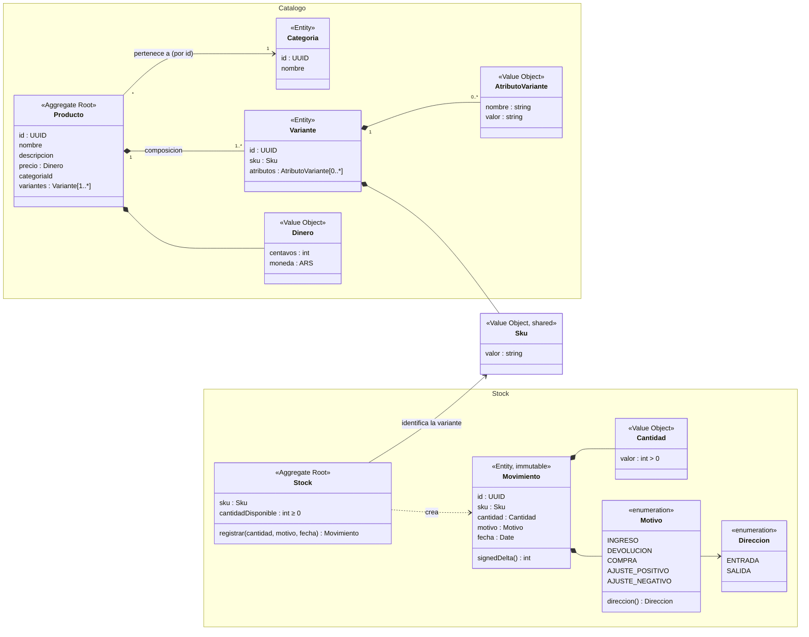
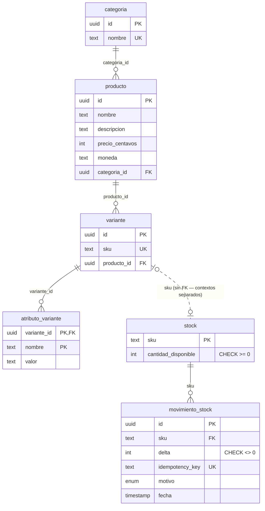

# ecommerce-challenge

---

## Enunciado

### Contexto

Una plataforma de ecommerce necesita gestionar su catálogo de productos y el stock disponible. Tu tarea es implementar una parte del backend usando NestJS.

### El dominio

La plataforma vende productos organizados en categorías. Un producto tiene un nombre, una descripción, un precio y pertenece a una categoría. Un producto puede tener variantes; por ejemplo, un mismo modelo de zapatilla existe en distintos talles y colores. Cada variante es la unidad que tiene stock propio y es la que el cliente agrega al carrito.

Cuando el stock de una variante cambia, el cambio tiene que quedar registrado: cuándo ocurrió, cuántas unidades se movieron y por qué motivo (por ejemplo una compra, una devolución o un ajuste manual). El sistema siempre tiene que poder responder cuánto stock hay disponible.

Cuando un cliente intenta agregar una variante al carrito, el sistema verifica si hay stock disponible. Si no hay, no puede agregarse.

### Lo que tenés que implementar

#### `POST /stock/movimientos`

El body llega con el SKU de la variante, la cantidad y el motivo. El sistema registra el movimiento y deja el stock disponible de esa variante en un estado correcto.

Definí vos cómo modelar cantidades, qué motivos aceptás y qué pasa cuando no hay stock suficiente para una salida.

### Stack esperado

- NestJS con TypeScript estricto
- TypeORM o Prisma
- PostgreSQL o SQLite

Se espera que el código tenga responsabilidades claras y bien separadas. Cómo lo estructurás queda a tu criterio.

### Entrega

Repositorio en GitHub con un historial de commits claro y legible — que se entienda cómo fuiste construyendo la solución — y documentación que refleje cómo pensaste el problema, cómo está organizado el sistema, las decisiones de diseño que tomaste y, si aplica, cómo correr o probar tu solución más allá de lo que ya describe este README.

El formato, ubicación y nivel de detalle quedan a tu criterio. Forma parte de la evaluación.

---

## Solución

Dos bounded contexts — **Catalogo** (qué vendemos) y **Stock** (cuánto hay y qué pasó) — se encuentran únicamente en el value object `Sku`. Stock sigue arquitectura hexagonal: el dominio (`Stock`, `Movimiento`, `Cantidad`, `Motivo`, `Sku`) es TypeScript puro sin dependencias, la aplicación (`StockService`) habla con un puerto (`StockRepository`), y los adaptadores (controller HTTP, repositorio TypeORM) traducen entre el dominio y el mundo exterior.

### Modelo de dominio



> **Catalogo es solo persistencia** en esta entrega: el modelo de arriba es el modelo objetivo documentado, pero el único endpoint pedido no crea ni consulta catálogo. Ver [Alcance de Catalogo](#alcance-de-catalogo).

### Motivos aceptados

El enunciado pide decidir qué motivos aceptar. Cada `Motivo` conoce su `direccion`, así que el signo viaja con el valor (`cantidad × motivo.direccion`) y no puede declararse un motivo sin dirección:

| motivo | direccion | significado |
|---|---|---|
| `INGRESO` | ENTRADA | reposición del proveedor |
| `DEVOLUCION` | ENTRADA | devolución de un cliente |
| `COMPRA` | SALIDA | compra de un cliente |
| `AJUSTE_POSITIVO` | ENTRADA | ajuste manual al alza |
| `AJUSTE_NEGATIVO` | SALIDA | ajuste manual a la baja |

### Stock insuficiente

El movimiento se rechaza con **409**, no se registra nada, y el body es un problem detail (`urn:problem:stock-insuficiente`) con `stockDisponible` como extension member. Sin excepción para `AJUSTE_NEGATIVO`: el stock nunca queda negativo.

### Modelo de datos



- **La línea punteada `variante — stock` es deliberada:** un FK `stock.sku → variante.sku` exigiría una relación ORM, que importaría una entidad de Catalogo dentro del módulo Stock. Los contextos se encuentran solo en `Sku` — si mañana viven en bases separadas (un split a microservicios), no hay ninguna constraint cross-context que desarmar. El precio: `INSERT INTO stock` con un SKU inexistente no lo rechaza la base; la integridad la garantiza la aplicación (`StockService.createItem` es el único punto de creación).
- **`movimiento_stock.sku → stock.sku` sí tiene FK**: ambas tablas pertenecen a Stock, el vínculo es gratis.
- **Invariante chequeable en SQL:** `stock.cantidad_disponible == SUM(movimiento_stock.delta)` por SKU — `delta` se guarda con signo para que la invariante sea una suma directa, y hay una spec que la verifica tras ejercitar varios motivos.
- **`atributo_variante` sin id surrogate:** es un value object (no tiene identidad), su PK `(variante_id, nombre)` es a la vez el backstop de unicidad de nombres por variante.
- **Ids generados por la app** (`randomUUID()` en las factories): la entidad nace con identidad y no depende de la base. `@PrimaryColumn('uuid')` mapea a `uuid` nativo en Postgres y `varchar` en SQLite — portable.

### Flujo de `POST /stock/movimientos`

1. `ZodValidationPipe` valida la forma del body (`z.strictObject` rechaza campos extra; `"3"` como string se rechaza).
2. El header `Idempotency-Key` es **obligatorio**: falta o vacío → 400 `urn:problem:clave-idempotencia-requerida`. El servidor se niega a aceptar una mutación que no puede deduplicar (ver [Idempotencia](#idempotencia)).
3. El controller construye `Sku`, `Cantidad`, `Motivo` — los value objects imponen las reglas de dominio.
4. `StockService` busca la key primero (replay o 422, ver abajo), luego carga el `Stock` por el puerto → `VarianteNoEncontradaError` (404) si no existe.
5. `stock.registrar(cantidad, motivo, fecha)` — fast-fail sobre el snapshot cargado, o devuelve el `Movimiento` inmutable.
6. El adapter persiste en **una transacción**:
   - `UPDATE stock SET cantidad_disponible = cantidad_disponible + :delta WHERE sku = :sku AND cantidad_disponible + :delta >= 0` — escribe el **delta**, nunca el valor absoluto en memoria;
   - 0 filas afectadas → otra request ganó la carrera → `StockInsuficienteError` (409);
   - 1 fila → inserta la fila del movimiento;
   - error Postgres `22003` (integer out of range) → `CantidadInvalidaError` (400).
7. Respuesta 201 con el movimiento registrado. El balance no viaja en el POST — es una consulta, la responde `GET /stock/:sku`.

El dominio **define** la regla y es testeable sin base; el adapter la **hace cumplir** atómicamente, porque un read-modify-write del agregado sería una carrera.

### Concurrencia

- **Postgres:** el UPDATE condicional toma un row lock; la transacción que espera re-evalúa el `WHERE` al obtenerlo. Sin overselling, sin `SELECT … FOR UPDATE`.
- **SQLite:** TypeORM comparte un solo QueryRunner, así que `transaction()` concurrentes anidan como SAVEPOINTs y pueden lanzar `SQLITE_BUSY`. El adapter serializa sus transacciones con un pequeño mutex de promesas in-process cuando `type === 'sqlite'` (SQLite es single-writer de todas formas; la ruta Postgres usa transacciones reales).
- `CHECK (cantidad_disponible >= 0)` queda como último backstop.

### Idempotencia

Sigue la semántica del draft IETF `draft-ietf-httpapi-idempotency-key-header`:

- **Key obligatoria** — sin header no hay mutación (400).
- **Misma key, mismo payload** → la columna `idempotency_key` (NOT NULL + unique) arbitra: el insert duplicado rompe, la transacción hace rollback y se re-lee la fila, devolviendo el `Movimiento` persistido — misma respuesta, una sola escritura. Bajo N requests concurrentes con la misma key, exactamente una aplica.
- **Misma key, payload distinto** → 422 `urn:problem:reintento-distinto`. El lookup de la key ocurre **antes** de procesar el movimiento: una key reutilizada con otro body se rechaza sin importar si el nuevo body hubiera sido válido. No hace falta columna de fingerprint — los campos ya viven en la fila del ledger.

### Errores

Toda respuesta de error es `application/problem+json` (RFC 9457) con `{type, title, status, detail, instance}`; `instance` lleva el `requestId`, así que una respuesta correlaciona con su wide event.

| error | `type` (`urn:problem:*`) | HTTP |
|---|---|---|
| Zod (forma del body) | `validacion` | 400 |
| `CantidadInvalidaError` / `SkuInvalidoError` / `MotivoInvalidoError` | `cantidad-invalida` / `sku-invalido` / `motivo-invalido` | 400 |
| `ClaveIdempotenciaRequeridaError` | `clave-idempotencia-requerida` | 400 |
| `VarianteNoEncontradaError` | `variante-no-encontrada` | 404 |
| `StockInsuficienteError` | `stock-insuficiente` (+ `stockDisponible`) | 409 |
| `ReintentoDistintoError` | `reintento-distinto` | 422 |
| cualquier otro throw | `about:blank` | 500 |

El `DomainErrorFilter` atrapa **todo** — no solo errores de dominio — así que un error del framework también sale como problem detail. El mapeo es una tabla `ErrorClass → status`; `type` se deriva del nombre de la clase, y `title`/`detail` salen de `summary`/`message` del propio error (la jerga HTTP queda en el adapter).

### Estructura

```
docs/
  openapi.yaml                    contrato de la API — escrito primero, servido en /docs
database/
  seed.sql                        datos de demo, SQL portable, re-runs no-op
Dockerfile                        node:22-slim + sqlite3 CLI (para el seed)
src/
  env.ts                          env declarada y validada con Zod (fail fast, sin defaults)
  data-source.ts                  dataSourceOptions(db) — única fuente de config TypeORM
  app.module.ts                   forRootAsync({...dataSourceOptions(), synchronize: true})
  main.ts                         sirve /docs (Swagger UI sobre el contrato)
  app.e2e.spec.ts                 specs end-to-end (node:test + fetch nativo)
  shared/
    domain/sku.ts                 Sku — el único vínculo entre contextos
    infrastructure/http/          zod-validation.pipe, domain-error.filter,
                                  wide-event.middleware, request-context (ALS)
  catalogo/
    infrastructure/persistence/   categoria, producto, variante, atributo-variante
  stock/
    domain/                       stock, movimiento, cantidad, motivo, errors, puerto
    application/stock.service.ts  createItem, registrarMovimiento, stockDisponible
    infrastructure/
      persistence/                orm-entities + TypeOrmStockRepository
      http/                       controller + Zod schema
```

### Decisiones y trade-offs

- **Variantes por composición, no herencia.** `Variante` es una entidad dentro del agregado `Producto`; talle/color son datos (`AtributoVariante { nombre, valor }`), no subclases. Cualquier combinación de atributos funciona sin cambio de esquema.
- **`atributo_variante` tabla relacional**, no columna JSON: `simple-json` de TypeORM es `TEXT` plano en ambas bases — no indexable, no constrainable, no filtrable en SQL; `jsonb` sería Postgres-only. La tabla es filtrable (`nombre='talle' AND valor='42'`) y queda a medio camino de option tables si el catálogo crece.
- **Invariantes en el dominio, constraints en la base solo como backstop.** La regla que cruza requests concurrentes no puede arbitrarla el proceso — la base es el único punto de serialización; cuando el backstop dispara, el adapter lo traduce al **mismo** error de dominio (`0 filas → StockInsuficienteError`, `22003 → CantidadInvalidaError`).
- **Sin límites inventados.** Sin máximo de negocio para `cantidad` ni largo máximo de SKU — el enunciado no los pide. Límites técnicos solamente: `Cantidad` es safe integer (`Number.isSafeInteger`; sin esto `1e20` se guardaría como float en SQLite), y las columnas de texto son `text` (un `varchar(n)` en Postgres es solo un check — mismo storage y performance).
- **`Dinero` en centavos enteros** (`precio_centavos`), nunca float. Sin librería de dinero: el challenge no hace aritmética de precios.
- **TypeORM, no Prisma.** Prisma soporta un solo provider por schema (`env()` no está permitido en `provider`), así que mantener ambas bases costaría dos schemas, dos carpetas de migraciones y dos clients generados. El ORM queda detrás del puerto `StockRepository`; los decoradores viven solo en los `*.orm-entity.ts` — el dominio es TypeScript puro.
- **Ambas bases (last responsible moment).** SQLite por defecto, Postgres por env; la suite corre igual en las dos. `synchronize: true` se mantiene del starter: las migraciones son específicas por base en cualquier ORM — un proyecto real elegiría una base y usaría migraciones.
- **Zod en vez de class-validator/class-transformer** (removidos: su único uso era el ValidationPipe global). Una lib valida los dos boundaries — body HTTP y variables de entorno. El reparto: **Zod valida la forma, los value objects validan las reglas.**
- **Contrato primero.** `docs/openapi.yaml` se escribió antes que la implementación y es la fuente de verdad; se sirve crudo en `/docs` (Swagger UI, sin parser de yaml). `@nestjs/swagger` rechazado: genera el spec desde decoradores sobre clases DTO — code-first, la dirección opuesta — y nuestros DTOs son `z.infer`, sin clases que decorar.
- **Wide events, sin librería de logging.** Un evento JSON por request, emitido una vez al final — éxito o error — con metadata (`requestId`, `method`, `path`, `statusCode`, `durationMs`), contexto de dominio (`sku`, `cantidad`, `motivo`, `error{type,message}`) y contexto de entorno (`service`, `version`, `commitHash`, `instanceId`). Middleware de Express + `AsyncLocalStorage` (stdlib); una escritura por request no necesita librería.
- **Entorno declarado.** `src/env.ts` lista con Zod **toda** variable que la app lee, sin defaults: una variable requerida ausente es un error de arranque, nunca un fallback silencioso. `discriminatedUnion('DB_TYPE')`: vars de sqlite XOR postgres.
- **El 201 no devuelve el balance.** `POST` responde "quedó registrado el movimiento"; "cuánto hay disponible" lo responde solo el GET. Un `stockDisponible` en la respuesta sería una foto que envejece al instante — y obligaría a persistir `stock_resultante` por fila solo para replay idempotente.
- **Ubiquitous language en español.** API, modelo, tablas y columnas usan los términos del enunciado (`Movimiento`, `cantidad_disponible`, `motivo`); la jerga técnica queda en inglés (`*Service`, `*Repository`, métodos de puerto `find`/`create`/`save`, DDD vocab — value object, aggregate root, bounded context).
- **Seed: SQL crudo, sin script.** Los datos de demo son estáticos y confiables — `database/seed.sql` portable, aplicado con los CLIs nativos (`sqlite3` en la imagen de app vía Dockerfile; `psql` ya viene en `postgres:17-alpine`). UUIDs literales + `ON CONFLICT DO NOTHING` hacen los re-runs no-op; las filas de stock y movimientos son consistentes con la invariante `SUM(delta)` por construcción.

### Alcance de Catalogo

**Decisión: persistencia solamente (final).** El enunciado pide un endpoint, `POST /stock/movimientos`; ningún endpoint crea ni consulta catálogo. Un dominio de Catalogo completo sumaría ~7 archivos que solo ejercitaría el seed.

**Lo que no se construyó:** clases de dominio `Categoria`/`Producto`/`Variante`, value objects `Dinero`/`AtributoVariante`, puerto `ProductoRepository`, endpoints de catálogo, invariantes de catálogo en código (los backstops de la base los cubren: SKU único, PK compuesta de atributos).

**Las formas de almacenamiento sí son finales** — `precio_centavos` + `moneda`, tabla `atributo_variante`, `sku` unique, UUIDs por la app — porque son caras de cambiar con datos existentes. Agregar endpoints de catálogo no necesita migración ni reordenar carpetas: `catalogo/domain/`, `application/`, `infrastructure/http/` van al lado de lo existente, y `crearProducto()` llamaría a `StockService.createItem()` por variante en la misma transacción.

**Consecuencia aceptada:** una variante insertada sin `createItem` (vía SQL directo) da 404 en movimientos de stock. Aceptable mientras solo el seed y los tests crean variantes.

### Fuera de alcance (y cuándo agregarlo)

- **Carrito/reservas, endpoints de catálogo, auth, paginación del ledger, precio por variante** — no los pide el enunciado.
- **Floods maliciosos con keys repetidas:** los retries accidentales están cubiertos (idempotencia); el abuso deliberado es auth/rate-limiting — fuera de scope sin modelo de auth.
- **El test de concurrencia SQLite prueba la lógica, no paralelismo real** — la corrida de Postgres es la prueba verdadera.

## Cómo correr

Todo corre por docker compose (no hace falta Node en el host):

```bash
docker compose build app     # una vez (o tras cambiar el Dockerfile)
docker compose up -d         # app en :3000 + postgres en :5432
```

Seed de datos demo (requiere que el schema exista — la app lo crea con `synchronize` al arrancar):

```bash
# sqlite (default)
docker compose exec -T app sqlite3 database.sqlite < database/seed.sql
# postgres
docker compose exec -T postgres psql -U postgres -d ecommerce_challenge < database/seed.sql
```

Verificación:

```bash
docker compose exec -T app npm run typecheck
docker compose exec -T app npm run lint
docker compose exec -T app npm test                    # sqlite in-memory
docker compose exec -T -e DB_TYPE=postgres -e DB_HOST=postgres \
  -e DB_PORT=5432 -e DB_USERNAME=postgres -e DB_PASSWORD=postgres \
  -e DB_DATABASE=ecommerce_challenge app npm test      # misma suite en postgres
```

Docs de la API: http://localhost:3000/docs (Swagger UI sobre `docs/openapi.yaml`).

Ejemplos:

```bash
# compra — descuenta stock (header obligatorio)
curl -s -X POST localhost:3000/stock/movimientos \
  -H 'Content-Type: application/json' -H 'Idempotency-Key: pedido-1001' \
  -d '{"sku":"ZAP-RUNNER-42-NEGRO","cantidad":2,"motivo":"COMPRA"}'
# → 201 {"id":"…","sku":"…","cantidad":2,"motivo":"COMPRA","fecha":"…"}

# retry con la misma key → misma respuesta, no descuenta dos veces
# retry con la misma key y OTRO body → 422 reintento-distinto

curl -s localhost:3000/stock/ZAP-RUNNER-42-NEGRO
# → {"sku":"ZAP-RUNNER-42-NEGRO","stockDisponible":8}
```

---

## About this repository

This repo is the starting point for the challenge. It includes NestJS 11, TypeORM 0.3, and support for SQLite (default) or PostgreSQL 17 (via Docker).

TypeScript is configured in strict mode with sensible additional rules (`noUncheckedIndexedAccess`, explicit return types, no `any`, no floating promises, etc.). Run `npm run typecheck` and `npm run lint` before submitting.

## Project structure

Two empty NestJS modules are included: `catalog` and `stock`. Use them, rename them, or reorganize — whatever fits your design.

## Requirements

- Node.js 22 LTS (`>=22`)
- npm >= 10

Use the version in `.nvmrc` if you rely on nvm:

```bash
nvm use
```

## Installation

```bash
npm install
cp .env.example .env
```

## Running the project

```bash
npm run start:dev
```

The app runs at `http://localhost:3000`. Verify it started with:

```bash
curl http://localhost:3000/health
```

## PostgreSQL with Docker (optional)

```bash
docker compose up -d postgres
```

Then update `.env`:

```env
DB_TYPE=postgres
DB_HOST=localhost   # 'postgres' si la app corre dentro de compose
DB_PORT=5432
DB_USERNAME=postgres
DB_PASSWORD=postgres
DB_DATABASE=ecommerce_challenge
```

## Migrations

By default the app uses `synchronize: true` in development for fast iteration. If you prefer migrations:

```bash
npm run migration:generate -- src/migrations/MigrationName
npm run migration:run
```

## Scripts

| Command              | Description           |
| -------------------- | --------------------- |
| `npm run start:dev`  | Dev server with watch |
| `npm run build`      | Compile               |
| `npm run lint`       | ESLint                |
| `npm run typecheck`  | Type checking         |
